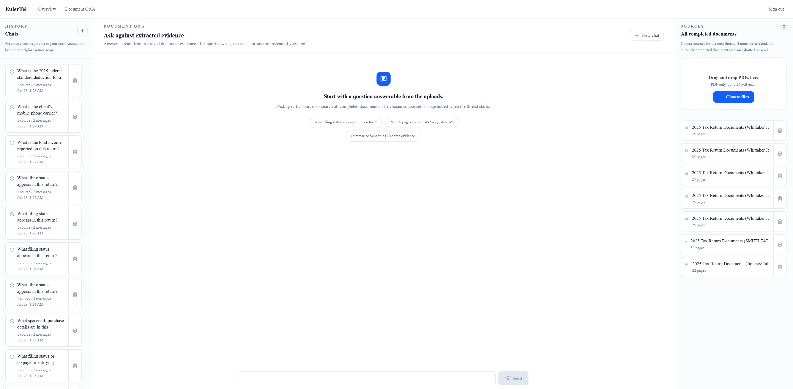
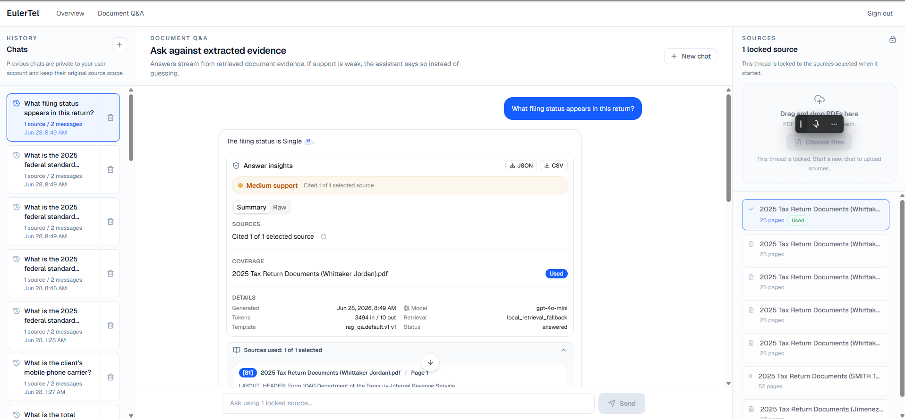
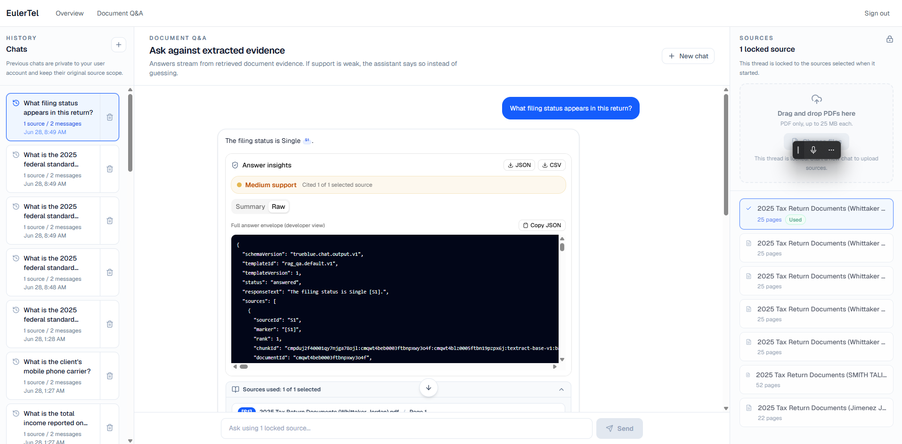
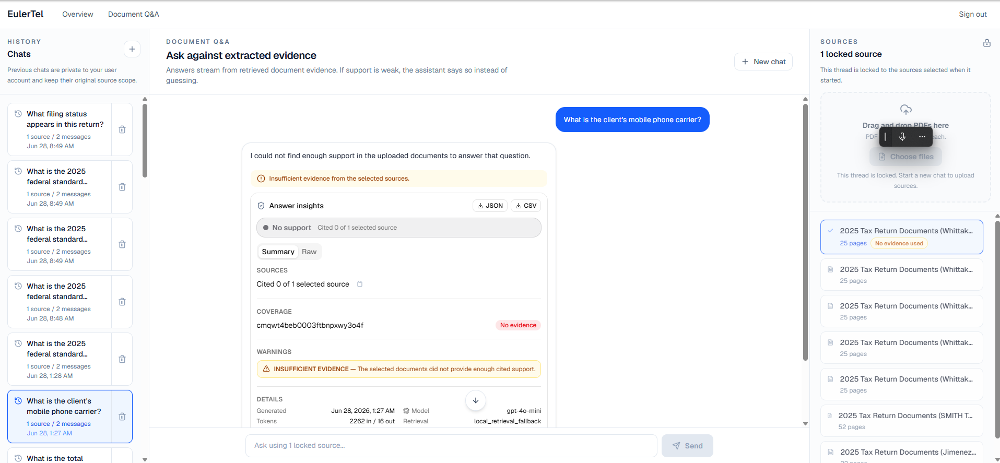

# Milestone 4 — Client Acceptance Testing Guide

**Stakeholder URL:** http://52.70.0.80
**Milestone:** Output Generation, Testing & Deployment
**Build tag:** `m4-20260627-191552-ed97574` (app + worker)
**Structured output schema:** `trueblue.chat.output.v1`
**Prerequisite:** Milestone 3 (vector database & grounded AI chat) is available

**Important — read before uploading anything:** The current stakeholder environment is served over **HTTP, not HTTPS**, and the application does **not yet redact PII** (SSN, bank/account numbers, email, phone) from answers. For M4 acceptance testing, use **only non-sensitive or redacted sample PDFs**. Do **not** upload real client tax documents until TLS/HTTPS and an output-layer redaction pass are complete or the risk is explicitly waived in writing. Open `http://52.70.0.80/login` directly with `http://`, not `https://`.

---

## Contents

- [What This Milestone Proves](#what-this-milestone-proves)
- [What M4 Delivers (Mapped to Scope)](#what-m4-delivers-mapped-to-scope)
- [Access](#access)
- [Test Environment](#test-environment)
- [Before You Start](#before-you-start)
- [UAT Test Matrix](#uat-test-matrix)
- [Detailed Test Walkthroughs](#detailed-test-walkthroughs)
- [Scope and Limitations](#scope-and-limitations)
- [Acceptance Criteria Checklist](#acceptance-criteria-checklist)
- [Sign-off](#sign-off)

---

## What This Milestone Proves

Milestone 4 validates the complete document Q&A path from upload through a **structured, source-cited response**, delivered through a chat interface on a deployed staging environment.

> **Plain-language note — "structured envelope":** alongside the readable answer, each response also carries a **structured envelope** — a single machine-readable record that bundles the answer text together with its source citations, page references, and support details. M4 proves this envelope is produced correctly; it is what you inspect in the **Raw / Structured JSON** view.

Scope acceptance criteria being tested (from the Phase 1 Statement of Work):

1. **End-to-end flow is functional:** upload a PDF, query it, and receive a **structured JSON response with source citations**.
2. **Output conforms to the agreed JSON schema** (`trueblue.chat.output.v1`).
3. **Chat interface allows query submission and displays structured responses with source citations.**
4. **System is deployed and accessible at the agreed endpoint/URL.**
5. **Deployment documentation is sufficient for an engineer to redeploy independently.**

What M4 deliberately does **not** cover (so testing stays in scope):

- OCR for scanned/image-only PDFs — **Milestone 5**.
- The full tax-domain **8-section advisory report**, tax-strategy categorization, advice disclaimers, usage dashboards, and admin rate-limit controls — **Milestone 6**. M4 proves the *grounded, source-cited structured envelope*, not advisory generation.

---

## What M4 Delivers (Mapped to Scope)

| SOW deliverable | What was built | Where to verify |
|---|---|---|
| Structured JSON output format (response text, source references, page/section metadata, confidence/relevance) | A server-built `trueblue.chat.output.v1` envelope: `responseText`, `sources[]`, `coverage`, `support` (confidence label + basis + retrieval mode), `warnings`, `metadata`. | TC-02 |
| Configurable output template engine with support for client-defined schemas | Registered templates `rag_qa.default.v1` (default) and `rag_qa.compact.v1`. Unknown templates are rejected. **Client-defined schemas are supported as approved/registered templates, not arbitrary runtime JSON schemas** (see Limitation 2). | TC-05 (confirmed by developer) |
| Chat/query interface with citations | A full-bleed chat workspace: query input, streamed answer with inline `[S1]` markers, source selection, citation detail (filename + page + snippet), an **Insights** view and a **Raw / Structured JSON** view, and a per-answer action bar (Copy / Regenerate). | TC-06, TC-07, TC-08 |
| End-to-end pipeline (upload → process → embed → query → response) | The full pipeline runs on staging and is exercised by the browser walkthroughs below. | TC-01 |
| Deployment to agreed staging environment | Deployed to `http://52.70.0.80` (AWS account `536573256060`), build tag `m4-20260627-191552-ed97574`. | TC-10 |
| Deployment documentation | Deployment notes, the output-contract reference, and this acceptance guide, delivered to the developer for independent redeploy. | TC-11 (developer-attested) |

---

## Access

**URL:** http://52.70.0.80 (HTTP only — see the caveat at the top of this document).

### Test accounts (staging seed)

| Email | Password | Role | Firm |
|---|---|---|---|
| admin@acmetax.com | FirmAdmin1! | Firm Admin | Acme Tax Services |
| user@acmetax.com | FirmUser1! | Firm User | Acme Tax Services |
| admin@besttax.com | FirmAdmin1! | Firm Admin | Best Tax Advisors |
| admin@trueblue.dev | Admin123! | Platform Admin | All firms |

Recommended account for most browser checks:

```text
admin@acmetax.com / FirmAdmin1!
```

Use `admin@besttax.com` only for the tenant-isolation check (TC-09). The Platform Admin account is **not** the primary document Q&A account, because M4 chat and upload are firm-scoped.

Registration firm codes (if you create your own user): `acme-tax`, `best-tax`.

> These are **throwaway** staging passwords on an HTTP environment. Do not reuse them anywhere real.

### Sample PDFs

Use the same non-sensitive sample tax returns used for M2/M3. The pre-verified sample document for this guide is:

- **`2025 Tax Return Documents (Whittaker Jordan).pdf`** (25 pages) — used for the worked examples in TC-01 and TC-08 below.

Other good candidates for the multi-source check:

- `2025 Tax Return Documents (Jimenez Julio).pdf`
- `2025 Tax Return Documents (SMITH TALIA S and Antonio Smith).pdf`

At least one text-based PDF must be uploaded or already present with status `COMPLETED`.

---

## Test Environment

| Property | Value |
|---|---|
| Endpoint | `http://52.70.0.80` (HTTP only) |
| Build tag | `m4-20260627-191552-ed97574` (app + worker) |
| AWS account | `536573256060`, region `us-east-1` |
| Schema version | `trueblue.chat.output.v1` |

If the `Sources` area shows no completed documents, upload one sample PDF and wait for `COMPLETED` before continuing.

---

## Before You Start

1. Open http://52.70.0.80/login (use `http://`).
2. Log in as `admin@acmetax.com`.
3. Open http://52.70.0.80/dashboard/chat.
4. Confirm the chat workspace loads: a query/composer area, a way to select **Sources**, a conversation area, and (after an answer) an **Insights** view and a **Raw / Structured JSON** view.

### Finding your way around

The tests below reference a few on-screen controls. Here is where each one lives:



- **Sources** panel — lists your firm's completed documents and lets you tick the ones a question should use. Its **upload / "Choose files"** control is how you add a new PDF.
- **History (Chats)** list — your saved conversations. Click a row to reopen a past chat; use **New thread** to start a fresh one.
- **Suggested-prompt chips** — the one-click example questions shown in an empty chat; you can click one or type your own question in the composer.
- **Answer + citations** — the answer streams into the conversation area. Cited passages show an inline marker such as `[S1]`; expand a citation to see the source filename, page, and snippet.
- **Insights** vs **Raw / Structured JSON** views — once an answer appears, a small view switch beside the answer lets you toggle between **Insights** (a plain-language summary: status, support, coverage) and **Raw / Structured JSON** (the full structured envelope as JSON). Several tests ask you to switch to the **Raw / Structured JSON** view.

> **Sequential uploads:** uploads are processed **one at a time per app process**. If two testers upload simultaneously, one may see `429 Too Many Requests`. Upload **one document at a time** and wait for `COMPLETED` before the next.

> **Upload size:** keep test PDFs under **20 MB**. The UI accepts files up to 25 MB, but the API rejects files over 20 MB (see Limitation 4). All provided sample PDFs are well under 20 MB.

> **Reporting issues during UAT:** record results in the [Acceptance Criteria Checklist](#acceptance-criteria-checklist) below. If a test fails or a result is unclear, **report it to the developer** with the question you asked, the response you got, and a screenshot.

---

## UAT Test Matrix

Status legend: **Client-to-run** = you execute this during UAT and record PASS/FAIL. **Developer-run / Developer-attested** = confirmed by the developer and reported; you acknowledge it in Sign-off (no client action required).

| TC | Scope criterion / deliverable | Steps (summary) | Expected result | Run by |
|---|---|---|---|---|
| **TC-01** | C1 — E2E upload → process → query → structured JSON w/ citations | Upload (or select) the Whittaker text PDF; wait for `COMPLETED`; select it; ask the filing-status / wages question. | Grounded answer (**filing status = Single; wages / total income = $27,645**) with an inline `[S1]` citation whose **cited source filename matches the document you selected**; the Raw / Structured JSON view shows `output.schemaVersion = trueblue.chat.output.v1`, `status = answered`, and **`support.retrievalMode = vector_retrieval`**. | **Client-to-run** |
| **TC-02** | C2 — Output conforms to `trueblue.chat.output.v1` | Open the **Raw / Structured JSON** view for an answered response. | All required fields present: `schemaVersion`, `templateId`, `templateVersion`, `status`, `responseText`, `sources[]`, `coverage`, `support`, `warnings`, `metadata`. `responseText` matches the visible answer; `sources[]` are final cited sources only with page metadata. | **Client-to-run** |
| **TC-03** | C1/C2 — Insufficient-evidence behavior | With a source selected, ask a question the document cannot answer (e.g. "What spacecraft purchase is in this return?"). | Assistant does not invent an answer; `status = insufficient_evidence`; `sources = []`; warning `INSUFFICIENT_EVIDENCE`; no citations shown. | **Client-to-run** |
| **TC-04** | C3 — Non-document message hygiene | Ask `hi` (a greeting) with a source selected. | Brief guidance, no citations; `status = non_document`; `sources = []`. | **Client-to-run** |
| **TC-05** | Deliverable — configurable output templates / "client-defined schemas" | **Developer-run:** the developer requests the compact registered template (`rag_qa.compact.v1`), then an unregistered template id, and reports the result. | Compact request returns `templateId = rag_qa.compact.v1` with valid cited sources. Unknown template returns **HTTP 400** (rejected). Confirms client-defined schemas are supported as **approved registered templates**, not arbitrary runtime schemas. | **Developer-run** (confirmed by developer) |
| **TC-06** | C3 — Chat UI shows structured responses + citations | In `/dashboard/chat`, ask a supported question; expand the citation and the structured views. | Answer streams into the conversation; inline `[S1]` marker; citation expands to filename + page + snippet; **Insights** view shows status/support/coverage; **Raw / Structured JSON** view shows the full `output` object; cited sources are marked "Used". | **Client-to-run** |
| **TC-07** | C3 — Thread persistence & replay | Ask a supported question; confirm a **History (Chats)** entry; reopen it. | Previous messages reload; **the saved answer reopens with its citations and structured details intact**; the locked source scope is preserved. | **Client-to-run** |
| **TC-08** | C3 — Source selection + multi-source coverage honesty | Start a new thread; select 2–3 completed PDFs (including the Whittaker return); ask "For each selected return, what taxpayer name is shown?" | Each selected return is addressed (**Whittaker return → Jordan Whittaker**); a return that lacks evidence for the field is explicitly called out (not silently dropped); citations correspond to the documents actually used; `coverage` reflects selected vs cited documents. | **Client-to-run** |
| **TC-09** | Security spot-check — tenant isolation | Confirm Acme docs/chats as `admin@acmetax.com`; sign out; log in as `admin@besttax.com`; confirm Acme data is not visible. | Best Tax cannot see Acme documents or chats. (See **Limitation 10** for the deferred prompt-premise wording item.) | **Client-to-run** |
| **TC-10** | C4 — Deployed and accessible | Open `http://52.70.0.80/login`; log in; open `/dashboard/chat`. | Login page loads; login succeeds; dashboard and chat load without server errors at the agreed endpoint. | **Client-to-run** |
| **TC-11** | C5 — Deployment documentation redeployable | **No client action.** The developer attests the deployment documentation delivered with this handoff is sufficient to redeploy and re-run M4 validation independently. | Developer confirms the deployment docs are sufficient; you acknowledge this in Sign-off. | **Developer-attested** |

---

## Detailed Test Walkthroughs

The matrix above is the spine of sign-off. The walkthroughs below give step-by-step detail for the browser checks.

### TC-01 — End-to-end: upload → process → query → structured response

1. Open `http://52.70.0.80/dashboard/chat`.
2. In the **Sources** panel, upload a non-sensitive text-based sample PDF (the **Whittaker** return is the pre-verified sample) using the **upload / "Choose files"** control — one at a time (see the sequential-upload note).
3. Wait for the document to reach `COMPLETED`.
4. Tick the document in **Sources** and ask:

   ```text
   What filing status and wages appear in this return?
   ```

**Expected (PASS):**

- The answer is grounded in the selected document. For the Whittaker return, **expect filing status = `Single`** and **wages / total income = `$27,645`**, and the answer cites a page of the Whittaker return with an inline marker such as `[S1]`.
- The **cited source filename matches the document you selected**.
- Switch to the **Raw / Structured JSON** view and confirm:
  - `schemaVersion` = `trueblue.chat.output.v1`
  - `status` = `answered`
  - **`support.retrievalMode` = `vector_retrieval`** — this means the AI searched the document index for the most relevant passages. **If it instead shows `local_retrieval_fallback`, the document search index was not used — that is a FAIL; report it to the developer.**



> Wording may vary slightly between runs, but the cited values and the source must match the Whittaker return.

### TC-02 — Output conforms to `trueblue.chat.output.v1`

**How to open the Raw / Structured JSON view:** after an answer appears, use the small view switch beside the answer (the **Insights / Raw** toggle) and select **Raw / Structured JSON**. The full structured envelope appears as JSON.

Confirm every field below is present, and that `support.retrievalMode` reads `vector_retrieval`:

| Field | Expected |
|---|---|
| `schemaVersion` | Exactly `trueblue.chat.output.v1` |
| `templateId` / `templateVersion` | `rag_qa.default.v1` / `1` |
| `status` | `answered` for a supported question (other values: `insufficient_evidence`, `non_document`) |
| `responseText` | Matches the visible answer |
| `sources[]` | Final cited sources only (marker/sourceId, documentId, page metadata, snippet) |
| `coverage` | Selected / retrieved / final / no-evidence document coverage |
| `support` | `confidenceLabel`, `confidenceBasis`, `retrievalMode`, source counts |
| `warnings` | Structured warnings, if any |
| `metadata` | Thread / message / timestamp |

**Annotated sample of a passing "answered" output** (the text after `//` is an explanation, not part of the JSON):

```json
{
  "schemaVersion": "trueblue.chat.output.v1",   // must be exactly this
  "templateId": "rag_qa.default.v1",            // the output template used
  "templateVersion": 1,
  "status": "answered",                          // a supported question was answered
  "responseText": "The filing status is Single [S1].",  // matches the on-screen answer
  "sources": [                                   // only sources actually cited in the answer
    {
      "sourceId": "S1",
      "marker": "[S1]",
      "documentId": "doc_1",                     // the selected document
      "pageStart": 1,
      "pageEnd": 1,
      "pageLabel": "Page 1",
      "snippet": "Filing status: Single"         // the supporting text
    }
  ],
  "coverage": { "selectedDocumentIds": ["doc_1"], "noEvidenceDocumentIds": [] },
  "support": {
    "confidenceLabel": "medium",
    "retrievalMode": "vector_retrieval"          // PASS — the document index was searched
  },
  "warnings": [],
  "metadata": { "threadId": "thread_1", "messageId": "message_1", "responseMode": "rag_qa" }
}
```

A PASS for Criterion 2 is: a valid `trueblue.chat.output.v1` envelope, with `responseText` matching the visible answer and `sources[]` listing the cited source(s).



> `support.confidenceLabel` is **source-support** confidence (how well retrieved evidence backs the answer), **not** tax-advice confidence. See Limitation 7.

### TC-03 / TC-04 — Insufficient-evidence and non-document behavior

- **TC-03:** with a source selected, ask an out-of-document question (e.g. a spacecraft purchase). Expect `status = insufficient_evidence` — the system's honest "I could not find enough support in your documents to answer that" result — with **no citations** and a warning `INSUFFICIENT_EVIDENCE`.

  

- **TC-04:** ask `hi`. Expect `status = non_document`, brief guidance, and no citations.

### TC-05 — Configurable output templates ("client-defined schemas") — *developer-run*

This check is run by the **developer** and the result reported to you; **you are not expected to run any API commands.** The developer requests the compact registered template and then an unregistered template id, and reports:

- The compact request returns `output.templateId = rag_qa.compact.v1` with valid cited sources.
- An unregistered/unknown template id is rejected with **HTTP 400**.

Together these confirm that "client-defined schemas" are delivered as **approved, registered templates** rather than arbitrary runtime JSON (Limitation 2). You acknowledge this developer-run result in Sign-off.

### TC-06 / TC-07 — Chat UI and thread replay

- Ask a supported question; confirm the streamed answer, inline `[S1]`, an expandable citation (filename + page + snippet), the **Insights** view (status/support/coverage), and the **Raw / Structured JSON** view.
- Confirm a new entry appears in **History (Chats)**; reopen it and confirm **the saved answer reopens with its citations and structured details intact**, with the source scope locked.

### TC-08 — Source selection and multi-source honesty

Start a new thread, select 2–3 completed PDFs (include the **Whittaker** return), and ask:

```text
For each selected return, what taxpayer name is shown?
```

Each selected return should be addressed — **the Whittaker return should return `Jordan Whittaker`**. Any return without supporting evidence for the asked field should be explicitly flagged (not silently omitted); citations should map to the documents actually used.

### TC-09 — Tenant isolation spot-check

Confirm Acme data as `admin@acmetax.com`, then sign in as `admin@besttax.com` and confirm Acme documents and chats are **not** visible.

> Note: data-layer tenant isolation holds — one firm cannot see or open another firm's documents. A separate **prompt-premise** wording edge case is tracked separately and described in **Limitation 10**; it is a wording/hygiene issue, **not** a cross-tenant data leak.

### TC-10 — Deployed and accessible

Open `http://52.70.0.80/login`, log in, and open `/dashboard/chat`. The login page should load, login should succeed, and the dashboard and chat should load without server errors.

### TC-11 — Deployment documentation — *developer-attested*

**No client action is required.** The developer attests that the deployment documentation delivered with this handoff (deployment notes, the output-contract reference, and this guide) is sufficient for an engineer to redeploy the system and re-run M4 validation independently — including environment variables, the database migration, and validation steps. You acknowledge this attestation in Sign-off; you do **not** need to open any repository files.

---

## Scope and Limitations

These are stated plainly so acceptance is honest. They define the boundary between a **controlled M4 demo on non-sensitive samples** (supported now) and **unrestricted real-tax-document use** (not yet).

1. **HTTP only — use redacted/non-sensitive samples only.** Staging is served over plain HTTP. Passwords and uploads are unencrypted in transit. Do **not** upload real client tax data until TLS/HTTPS is added or the risk is explicitly waived.
2. **"Client-defined schemas" = approved registered templates, not arbitrary runtime schemas.** M4 delivers a configurable template engine with registered templates (`rag_qa.default.v1`, `rag_qa.compact.v1`). Unknown/unregistered templates are rejected (HTTP 400). New client output shapes are added by registering a template, not by posting an arbitrary JSON schema at runtime.
3. **Tax-domain advisory output is M6, not M4.** M4 proves the **source-cited structured envelope** (`responseText` + `citations` + `coverage` + retrieval-support `confidence` + `warnings`). The full 8-section tax advisory report, strategy categorization, and advice disclaimers are Milestone 6.
4. **Upload size: UI/proxy allows up to 25 MB, but the API rejects files over 20 MB.** A file between 20–25 MB can pass the proxy and then be rejected by the application (HTTP 413, "exceeds maximum of 20MB"). Recommendation: align the UI/proxy limit to 20 MB. For testing, keep sample PDFs comfortably under 20 MB (all provided samples are well under).
5. **Uploads are serialized per app process.** Simultaneous uploads from multiple testers can return `429 Too Many Requests`. Upload one document at a time and wait for `COMPLETED`.
6. **Operational docs/tooling still reference some legacy paths.** These are being cleaned up before a polished, single-source redeploy runbook is finalized. They do not affect client testing but are noted for transparency.
7. **PII redaction is not yet implemented, and numeric field-mapping is pending SME certification.**
   - The chat can echo identifier PII (SSN, bank/routing/account numbers, email, phone) verbatim from a source document. There is no output-layer masking yet. This is the primary reason to use **redacted/non-sensitive samples only** until a redaction pass ships.
   - The system enforces that answers are **grounded** and tied to a **real page** of a real document, and it strips unsupported numbers. It does **not** yet certify that a given figure maps to the **intended tax line** (e.g. that "9,649" is the *total tax* line). Numeric **field-mapping correctness** requires subject-matter-expert (SME) certification, which is pending.
8. **Response time — expect a few seconds per answer.** Each response is retrieved, re-ranked for relevance, and grounded before it is returned, so answers typically take **a few seconds** (up to ~10–15s for complex multi-document questions, or for the first request after an idle period). This is expected behaviour, not an error.
9. **Relevance re-ranking runs on a shared service tier.** Retrieved evidence is re-ranked for relevance before answering. Under heavy **simultaneous** testing this may slow responses or briefly fall back to standard retrieval ordering — the system **degrades gracefully and does not fail**. For the cleanest, most comparable results, have testers run **sequentially** where practical.
10. **Deferred prompt-hardening.** A deliberately misleading prompt — for example, "list another firm's clients" — can cause the assistant to *mislabel the user's own firm data*. This is a wording/hygiene issue, **not** a cross-tenant data leak: data-layer tenant isolation still holds (foreign-document probes fail closed). A prompt-hardening fix is **deferred**.

Additional product notes (consistent with prior milestones):

- AI wording may vary between runs, but answers must remain supported by the selected source evidence.
- `insufficient_evidence` is a **correct** result when the selected documents do not support the question.
- OCR for scanned/image PDFs is M5; the full tax advisory categorization is M6. Neither should block M4 acceptance.

---

## Acceptance Criteria Checklist

Use this for sign-off. Each item is either **client-checkable** in the browser or marked **(developer)** where it is confirmed by the developer and acknowledged in Sign-off.

**Criterion 1 — End-to-end upload → process → query → structured response**
- [ ] A text-based PDF uploads and reaches `COMPLETED` (or is already present as a selectable source).
- [ ] The document appears as a selectable source.
- [ ] A supported query returns a grounded answer with a citation (for the Whittaker return: filing status = `Single`; wages / total income = `$27,645`).
- [ ] The Raw / Structured JSON view shows `output.schemaVersion = "trueblue.chat.output.v1"`, `status = "answered"`, and `support.retrievalMode = "vector_retrieval"`.
- [ ] The cited source filename matches the document you selected. *(Optional developer/API note: `output.sources[].documentId` equals the uploaded document's id.)*

**Criterion 2 — Output conforms to the agreed JSON schema**
- [ ] `schemaVersion`, `templateId`, `templateVersion`, `status`, `responseText`, `sources`, `coverage`, `support`, `warnings`, `metadata` all present in the Raw view.
- [ ] `responseText` matches the visible answer; `sources[]` are final cited sources only.
- [ ] Unsupported question → `insufficient_evidence`, 0 sources, `INSUFFICIENT_EVIDENCE` warning.
- [ ] Greeting / non-document message → `non_document`, 0 sources.
- [ ] Compact template → `templateId = "rag_qa.compact.v1"`; unknown template → HTTP 400. **(confirmed by developer — TC-05)**

**Criterion 3 — Chat interface**
- [ ] User can submit a query and see the answer in the conversation.
- [ ] Inline citation marker + expandable citation (filename, page, snippet) appear for grounded answers.
- [ ] Insights view shows status/support/coverage; Raw / Structured JSON view shows the full `output`.
- [ ] History saves the thread; reopening replays the answer with its citations and structured details intact; source scope stays locked.
- [ ] Multi-source query addresses each selected document or flags no-evidence per document.

**Criterion 4 — Deployed and accessible**
- [ ] `http://52.70.0.80/login` loads.
- [ ] Login succeeds; `/dashboard/chat` loads without server errors.

**Criterion 5 — Deployment documentation (developer-attested)**
- [ ] The developer attests that the deployment documentation delivered with this handoff is sufficient for an engineer to redeploy and re-run M4 validation independently. **Client acknowledges in Sign-off** (no repository files need to be opened).

**Supporting checks**
- [ ] Best Tax cannot see/access Acme documents or chats. *(See Limitation 10 for the deferred prompt-premise wording item.)*
- [ ] In the Raw view, the public output shows **no system-prompt text, keys, or secrets**. (If anything like that appears, that is a FAIL — report it to the developer.)

---

## Sign-off

| Field | Value |
|---|---|
| Milestone | M4 — Output Generation, Testing & Deployment |
| Build tag | `m4-20260627-191552-ed97574` (app + worker) |
| Environment | `http://52.70.0.80` (HTTP, staging), AWS account `536573256060` |
| Schema version | `trueblue.chat.output.v1` |
| Developer attestation | The developer attests M4 was validated end-to-end on staging; the configurable-template / registered-schema check (TC-05) and the deployment documentation (TC-11) are confirmed by the developer. |
| Acceptance scope | Controlled M4 testing on **non-sensitive / redacted** sample PDFs over HTTP |

**Sign-off acknowledges:** the five SOW acceptance criteria above are met on staging for non-sensitive sample documents — including the **developer-attested items** (the configurable-template behavior in TC-05 and the deployment documentation in TC-11) — **and** that the Scope and Limitations section (especially HTTP-only, no PII redaction, and pending SME numeric-field certification) is understood. Sign-off does **not** authorize unrestricted real-client-tax-document use; that is gated on TLS/HTTPS + an output-layer PII redaction pass (or an explicit written waiver).

| Role | Name | Decision (Accept / Accept-with-conditions / Reject) | Date |
|---|---|---|---|
| Client approver (EulerTel) | | | |
| Delivery (developer) | | | |

**Conditions / notes:**

```text
(record any conditions, deferred items accepted, or follow-ups here)
```
